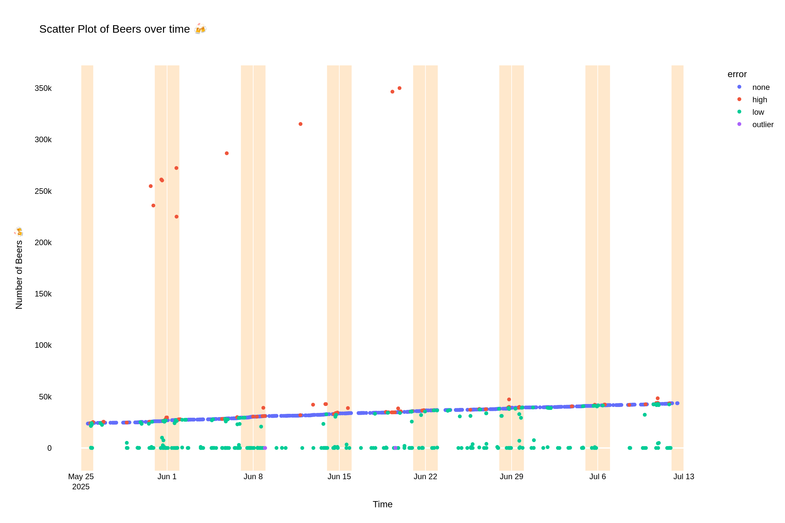
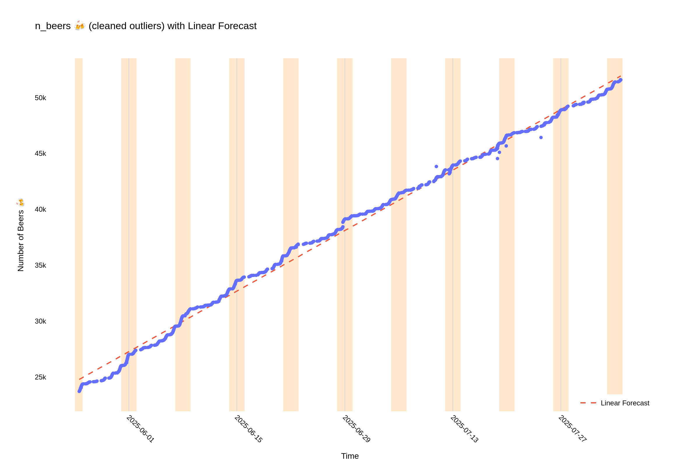

# 1 Million Beers
A group of 1,024 lads are attempting to collectively drink 1 million beers.

All beers are logged in a WhatsApp group chat. Any beer, cider, stout or otherwise count. Regardless of size - a pint, a can, a bottle, or a 2 litre stein - all count as one beer.

Each photo should is accompanied by a message indicating the cumulative beer count.

# Data cleaning
The cumulative beer count results in errors propagating across multiple messages. To enable forecasting, some simple rules have been applied to clean the data.

# Forecast Update
This is a summary of the beer rates and forecasts for the next 10,000 beers.

Linear Forecast Update
Generated on: 2025-08-03 18:43:26
Source file: WhatsApp Chat with 1 Million Beers 20250712 1149.zip

Data Summary:
- Total messages processed: 4059
- Clean data points: 3449
- Current beer count: 43,838
- Rate per hour: 17.29 beers/hour
- Model intercept: 24245.79

Forecasts:

Next 10k milestone (50,000 beers):
At a rate of 17.29 beers/hour, it will take approximately 14.8 days to go from 43,838 to 50,000 beers.

One Million Beers Goal:
At a rate of 17.29 beers/hour, it will take approximately 6.3 years (2031-11-02) to reach 1,000,000 beers (from 43,838).
