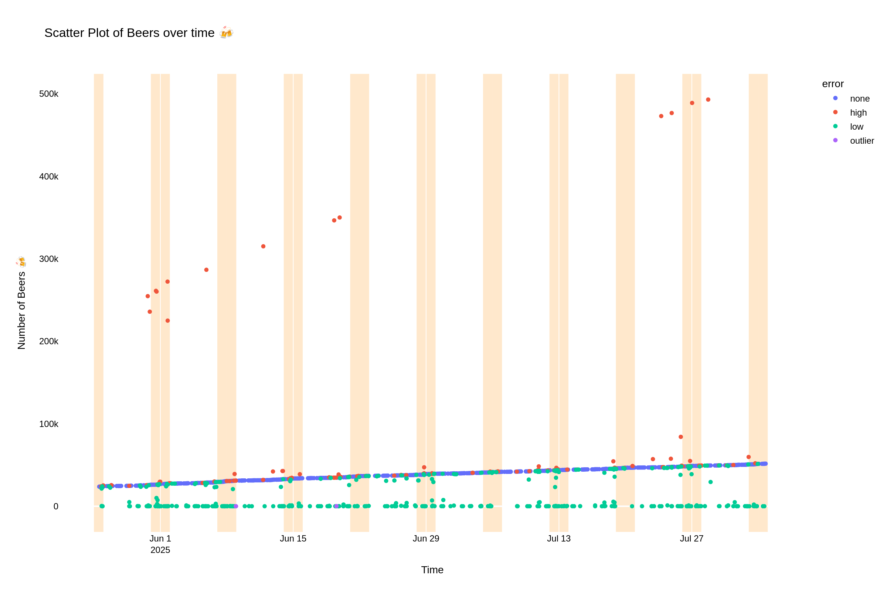

# 1 Million Beers
A group of 1,024 lads are attempting to collectively drink 1 million beers.

All beers are logged in a WhatsApp group chat. Any beer, cider, stout or otherwise count. Regardless of size - a pint, a can, a bottle, or a 2 litre stein - all count as one beer.

Each photo should is accompanied by a message indicating the cumulative beer count.

# Data cleaning
The cumulative beer count results in errors propagating across multiple messages. To enable forecasting, some simple rules have been applied to clean the data.

# Forecast Update
This is a summary of the beer rates and forecasts for the next 10,000 beers.

Linear Forecast Update
Generated on: 2025-08-03 18:16:24
Source file: WhatsApp Chat with 1 Million Beers 20250803 1911.zip

Data Summary:
- Total messages processed: 6357
- Clean data points: 5396
- Current beer count: 51,605
- Rate per hour: 16.12 beers/hour
- Model intercept: 24772.39

Forecasts:

Next 10k milestone (60,000 beers):
At a rate of 16.12 beers/hour, it will take approximately 21.7 days to go from 51,605 to 60,000 beers.

One Million Beers Goal:
At a rate of 16.12 beers/hour, it will take approximately 6.7 years (2032-04-19) to reach 1,000,000 beers (from 51,605).
